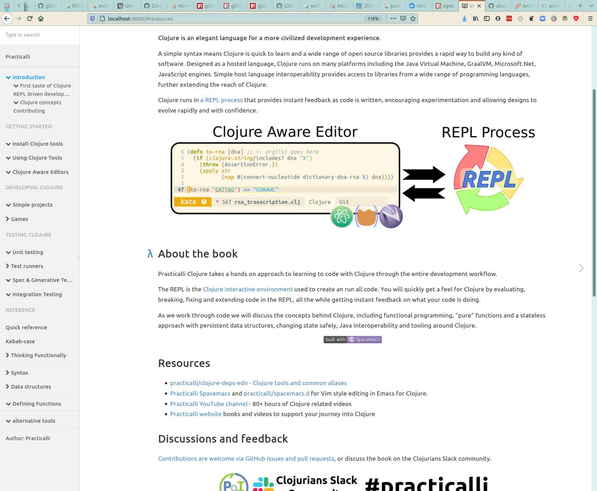

# Anchor.js for Gitbook

Add html anchor references to heading tag leves 1 to 5.  Each heading has a lambda icon that appears on the left of each heading when the mouse hovers over the heading.



Clicking on a lambda anchor updates the current page url, adding the `#heading-name`.  The updated URL can be used to add deep links into the book, rather than just a page.

```js
{
    "plugins": ["anchor-headings-lambda"]
}
```

## Reference
* [anchor.js](https://github.com/bryanbraun/anchorjs)

## License
Copyright © 2020 [jr0cket](https://github.com/jr0cket)

Distributed under the [Creative Commons Zero license](https://creativecommons.org/share-your-work/public-domain/cc0/).
